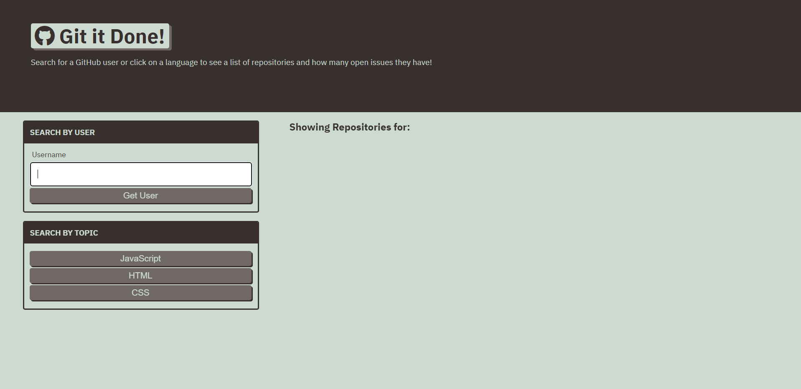

# git-it-done

- Github URL: https://github.com/DanielCConlon/git-it-done
- Github Pages: https://danielcconlon.github.io/git-it-done/

## Table-of-Contents

- [Description](#description)
- [Usage](#usage)
- [Application](#application)

## [Description](#description)

This application uses GitHub's API to search for open source projects with open issues and pull requests. This app was created by following the steps of a course module on Third Party APIs.

## [Usage](#table-of-contents)

- Open website and search by Github username, or search by topic.
- After the search the app shows repositories for that search and you can click on the repository to see the open issues.

## [Application](#table-of-contents)

